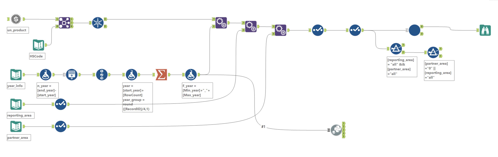
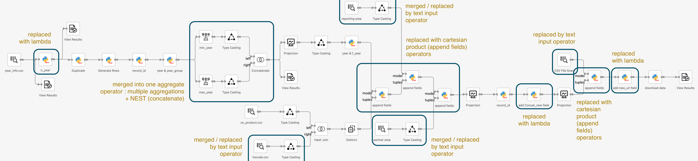

##### (This work was done by the author at Department of Computer Science, UC Irvine.)

In this blog, we discuss how we extended Texera’s usability by providing more native support for certain advanced data analysis operations and demonstrate their benefits in a workflow migrated from Alteryx.

Texera offers a workflow operator called “Python UDF,” which enables users to specify any desired operator behavior that best suits their needs.  It is a powerful tool that offers users high levels of control over their workflows.  While this operator enables Texera to provide the same data processing capabilities as the Alteryx platform, it comes with the drawback of requiring users to code.  Some users may not be familiar enough with the Python programming language to clearly express their intended use cases.  Others may find that even if they are comfortable with Python, having to code up their own operators is an extra layer of complexity.

We want to streamline the user experience by adding several native operators to Texera that address common elements of Alteryx workflows.

### Initial Try at Migrating an Alteryx Workflow to Texera

In our efforts to enhance the Texera platform, we have referenced a real data analysis workflow, which generates several URLs to online datasets and downloads their web content based on the URLs. This original workflow is shown in the image below.

<figure>

<figcaption align = "center"><i>Figure 1: The original workflow in Alteryx</i></figcaption>
</figure>

Before the introduction of new native operators, the same data analysis process can be achieved in Texera with the following workflow.

<figure>

<figcaption align = "center"><i>Figure 2: The initial migrated workflow in Texera</i></figcaption>
</figure>

We can see that initially, the Texera workflow utilized several Python UDF operators and had an inflated workflow size relative to the Alteryx workflow.  The Alteryx workflow used 26 operators, while the Texera workflow used 35 data processing operators, 14 of which were Python UDF operators. This is due to the fact that some native operators in Alteryx were not available in Texera.

### Improving the Texera Platform

The goal of this project is to migrate usages of the Python UDF operators into natively supported Texera operators.  We identified the following common use cases found in this workflow which Texera should address by updating or introducing new native operators:

* Allow users to manually input text to be used as an input source;
* Support multiple aggregations in a single GROUP BY function;
* Support the NEST aggregation function;
* Support simpler lambda expressions instead of high-code Python UDF operators;
* Support generating extra fields for workflow tables;
* Support appending the fields of one input to another (“CARTESIAN PRODUCT”);
* Support downloading (curl/wget) operations.

#### User-Specified Text As an Input Source

A new source operator called “TextInputSource” was created to allow users to manually input data to be used in the workflow, rather than having to create a file, upload it, and scan it before its data can be used in the rest of the workflow.

Users have the ability to select from multiple input types and can specify whether input is treated as one or multiple rows separated by line breaks.  This operator is suited for cases in the Alteryx workflow where users simply need to enter a small amount of input data, which is not worth creating an entire file for.

Codebase Changes

* Pull request (“PR”) introducing the text input operator = [Introducing Text Input](https://github.com/Texera/texera/pull/1868)
* Other related PRs = [Naming Output Attribute](https://github.com/Texera/texera/pull/1922), [Selecting Attribute Type](https://github.com/Texera/texera/pull/1985)

#### Centralizing Multiple Aggregations & Supporting NEST Aggregation

The existing “Aggregate” operator has been extended to allow multiple aggregation functions to be defined in the same place.  This change simplifies the visualization of complex GROUP BY clauses and centralizes the usage of aggregation.

Support for NEST aggregation has also been supported with the CONCAT mode on the operator.  Two specific column values can be concatenated together in a new, output column containing the nested strings.

Codebase Changes

* [Multiple Aggregate Functions](https://github.com/Texera/texera/pull/1798), [Add NEST Aggregate Function](https://github.com/Texera/texera/pull/1746)

#### Low-Code Lambda Expressions & Adding New Fields

A new Python Lambda operator has been introduced to the Texera platform, which allows for quick changes in adding/modifying fields (columns).  It is a low-code operator, which means users can specify what changes they want without having to code it themselves as they would have to do in a Python UDF operator.

This operator is suited for use cases in the Alteryx workflow where users need to create new fields that will be used in generating URL elements such as query parameters.

Codebase Changes

* PR for Adding New Columns: [Lambda Operator For Adding New Column](https://github.com/Texera/texera/pull/1779)
* Other Related PRs: [Modify Existing Columns](https://github.com/Texera/texera/pull/1782), [Refactoring](https://github.com/Texera/texera/pull/1792)

#### Append Fields

A new Cartesian product operator has been introduced that enables users to append entirely the columns from one input with another.  A simple user interface is provided to users, and they simply need to connect two inputs to the operator input ports to generate the resulting appended fields.

This operator is suited for use cases in the Alteryx workflow where all output fields need to be appended from two input sources.

Codebase Changes

* [Cartesian Product Operator](https://github.com/Texera/texera/pull/1911)

#### Download Web Content

A new operator called “Bulk Downloader” has been introduced that enables users to download one or more URLs and save them into specified file paths.  This operator simplifies the final step of the Alteryx workflow, which enables users to control how to save their retrieved data.

Codebase Changes

* [Initial Download Operator](https://github.com/Texera/texera/pull/1805)
* [Refinement Into Bulk Download Operator](https://github.com/Texera/texera/pull/1823)

### Simplified Texera Workflow

Figure 3 is the new Texera workflow using the new operators.

<figure>

<figcaption align = "center"><i>Figure 3: The final, simpler workflow in Texera</i></figcaption>
</figure>

Figure 4 shows the differences between the two Texera workflow versions.

<figure>

<figcaption align = "center"><i>Figure 4: Difference between before and after using the new native operators</i></figcaption>
</figure>

We can see in the final, simpler workflow, fewer Python UDF operators are used and the overall workflow size has been reduced.  The new workflow has 7 fewer operators, resulting in only 28 operators. 10 operators have been replaced with simpler, native Texera operators including the Python lambda, Cartesian product, and Text input operators.

## Acknowledgements

Special thanks to Xiaozhen Liu, Professor Chen Li, Professor Hui Zhang, Tony Liu, and the Texera team for their support and efforts in this project.
