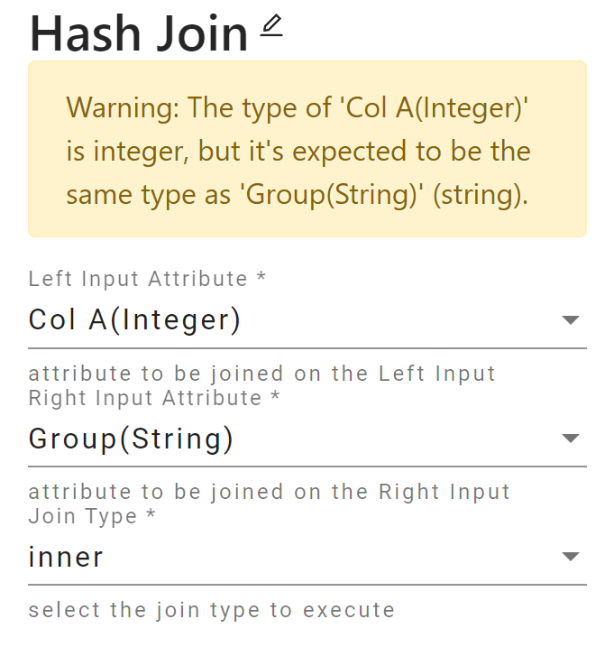

## Background

### What are operator properties

Texera workflows consist of sequences of operators. Every operator has properties as the parameters of the data process function. For example, in Figure 1, the "Filter" operator has three properties, `Attribute`, `Condition`, and `Value`. 

Among the properties, there are attribute properties that accept input attribute names as values, usually describing the attributes that the operator applies. In this operator, `Attribute` is an attribute property, and `amount` is the attribute to which the filter will apply.

The property values in Figure 1 indicate that the operator filters the records with an `amount` greater than 1.

<figure align="center">

<figcaption><i>Figure 1: Filter Operator Properties</i></figcaption>
</figure>

### What are operator input schemas

Various formats of data can be processed by Texera, and the format of data is represented by its schema, which is a set of attributes. In order to let every operator know what attributes of the data are available, each operator deduces its output schema using its input schema and propagates it to the next operator. The propagation is done in topological order from source operators to sink operators in the workflow, which is a directed acyclic graph (DAG) of operators. This mechanism is called "schema propagation." Schema propagation is an important part of the system, as it is the base of many useful features such as operator validation and attribute autocomplete.

### What is attribute autocomplete

Many operators have properties that accept an input attribute name as the value. For example, the `Attribute` property in the "Sentiment Analysis" operator takes the name of the attribute on which it will perform analysis. Autocomplete feature allows users to select an input attribute from a dropdown menu instead of manually typing in the name.

<figure align="center">

<figcaption><i>Figure 2: Dropdown Menu for Attribute Autocomplete</i></figcaption>
</figure>

## Auto Attribute Correction

PR: <https://github.com/Texera/texera/pull/1663>

### Motivation

In the old version of Texera, when an attribute name in the input schema of an operator changes, the field of this operator that selects the attribute will not update its value according to the change in the attribute name, and the operator will therefore become invalid. Intuitively, it is expected that the field will be updated accordingly. 

Moreover, when an attribute is deleted from the input schema, the field of the operator that contains the attribute will not be cleared and the operator will not be invalidated, which will cause a runtime error that the user can't see in the backend, due to the invalid attribute selection, when the user tries to execute the workflow. To avoid this, it is expected to clear the fields containing the deleted attribute and invalidate the operator.

Therefore, we introduce the auto attribute correction feature that automatically corrects the attribute selection in operators whenever an attribute is renamed or deleted.

### Demonstration

The auto attribute correction feature updates the attribute selection in an operator under the following circumstances

1. when the attribute selected in the operator is renamed, or
2. when the attribute selected in the operator is deleted.

Note that when a new attribute is added or when the attribute is cast to another type, the auto attribute correction feature does no action.

#### When an attribute is renamed

When a user renames an attribute through an operator, the attribute name will be updated in all succeeding operators.

Figure 3 shows how the attribute selection is automatically updated in the "Filter" operator when the result attribute name is changed in its preceding "Sentiment Analysis" operator.

When the user changes the name of the output attribute of the "Sentiment Analysis" operator from `"X"` to `"Y"`, the `Attribute` field whose value was `"X"` in the succeeding “Filter” operator is automatically updated to `"Y"`.

<figure align="center">

<figcaption><i>Figure 3: Auto Correction Process When an Attribute Is Renamed</i></figcaption>
</figure>

#### When an attribute is deleted

In case of an attribute selected in an operator is deleted, e.g., deselected in a projection operator, all succeeding operators containing the attribute will delete the attribute from themselves and become invalid.

### Implementation

To automatically correct the attribute selection in operators' properties, we need to do the following steps when the input schema changes:

1. Determine what input attribute changes (rename or delete)
2. Correct the attribute selection
#### Determine attribute change

It is easy for an operator to know when its input schema is changed. However, it can be challenging to determine what attribute is changed and what it changes to because all an operator knows about its input is the input schema, which is a list of attribute names and types.

In our auto attribute correction implementation, we choose to compare the input schema before the change and after the change. That is, we keep a copy of the input schemas for all operators, and when an input schema changes, we compare the new input schema with the last input schema in our copy and determine the change. 

When comparing the old and new input schemas, we can easily find out what attributes are unchanged, but there may be attributes in the old and new input schemas that do not match, which means that these attributes may be 1) newly created in the new schema, 2) renamed, or 3) deleted in the new schema.

Tables 1 and 2 are examples of the old and new input schemas. Let's try to determine how it changes. 

Here is a possible situation that happened to the input schema. `Column A` is unchanged since it exists in both schemas. `Column B` is deleted since it exists in the old schema but disappeared in the new schema. `Column C` is renamed to `Column D` since `Column C` is no longer there in the new schema but there's a new `Column D` with the same integer type in the new schema. Lastly, `Column E` is a new attribute since there is no attribute similar to it in the old schema. 

However, this determination could be wrong. It is possible that `Column C` is not renamed but deleted and `Column D` is a new attribute with the same type string. Moreover, it is also possible, despite unlikely, that `Column B` is not deleted but renamed to `Column E` and converted from integer type to boolean type.

<figcaption align="center"><i>Table 1: Old Input Schema (Example 1)</i></figcaption>

|Attribute Name|Attribute Type|
|--|--|
|Column A|integer|
|Column B|integer|
|Column C|string|

<figcaption align="center"><i>Table 2: New Input Schema (Example 1)</i></figcaption>

|Attribute Name|Attribute Type|
|--|--|
|Column A|integer|
|Column D|string|
|Column E|boolean|

Given that the determination is not unique, we need an algorithm to determine what are the most likely attribute changes that happened to the input schema update. With the algorithm, we can know for the unmatched attribute, what attribute in the old schema corresponds to the attribute in the new schema, or whether an attribute is created or deleted. Inspired by how we compute the similarity between two strings in computer science using the edit distance as the metric, we adapt our own edit distance algorithm to compute the similarity between two attributes (name and type). 

In the Levenshtein edit distance algorithm used for strings, the distance is measured by the minimum number of single-character edits (insertions, deletions, or substitutions) required to change one word into the other. For example, the distance between "**k**itten" and  "**s**itten" is 1 because of the substitution of "s" for "k". Please refer to <https://en.wikipedia.org/wiki/Levenshtein_distance>.

In our attribute edit distance algorithm, we compute the distance based on the name and the type. Unlike the Levenshtein distance where single-character insertions, deletions, and substitutions all have distance 1, we consider insertion and deletion to have distance 1, and update to have various distances depending on the name and type change, reflected in Table 3.

The distance is based on the likelihood of the change. For the edit distance for an update, if either attribute name or type is changed, then it has a distance of 1. If both the attribute name and type are changed, it is considered unlikely, thus having a distance of 2.

<figcaption align="center"><i>Table 3: Attribute Edit Distance</i></figcaption>

| Attribute Change | Distance |
|--|--|
| Insertion | 1 |
| Deletion | 1 |
| Update | 1 or 2 (See Table 4) |

<figcaption align="center"><i>Table 4: Attribute Edit Distance for Update</i></figcaption>

| Attribute Name | Attribute Type | Distance |
|--|--|--|
| Changed | Unchanged | 1 |
| Unchanged | Changed | 1 |
| Changed | Changed | 2 |

With this algorithm, for the old and new input schema example, we can say that `Column C` is believed to be renamed to `Column D`, instead of that `Column C` is deleted and `Column D` is a new attribute, because the former case has distance value 1 while the later case has distance value 2 (1 deletion+ 1 insertion). Also, `Column B` is deleted instead of renamed and typecasted to `Column E`, because deletion only has distance 1, but the rename and typecasting is considered an update of distance 2.

#### Correct attribute selection

In every operator involving input schema changes, after the determination, we update the attribute selection in the operators recursively based on the determination.

The property update is conducted recursively because the object of operator properties can be nested with deep properties. All property values are recursively traversed to find the property with the value of the old attribute name and update with the new attribute name.

### Limitations

The implementation of the auto attribute correction cannot always find out the correct attribute changes because of the attribute edit distance algorithm. We should notice due to the limited information that an operator knows about its input schema, it can only "guess" what changes happened, but cannot confidently determine the changes. While we find out the most likely changes using our edit distance algorithm, the method shall not be considered 100% correct. Moreover, in some cases, two possible changes may be the same edit distance. In the example of Tables 4 and 5, it is possible that `Column A` is renamed to `Column C` and `Column B` is renamed to `Column D`, meanwhile it is also possible that `Column A` is renamed to `Column D` and `Column B` is renamed to `Column C`. Both possibilities have distance 2. In this case, our edit distance algorithm may take either result.

<figcaption align="center"><i>Table 5: Old Input Schema (Example 2)</i></figcaption>

|Attribute Name|Attribute Type|
|--|--|
|Column A|integer|
|Column B|integer|

<figcaption align="center"><i>Table 6: New Input Schema (Example 2)</i></figcaption>

|Attribute Name|Attribute Type|
|--|--|
|Column C|integer|
|Column D|integer|

## Attribute Type Validation

*Issue: <https://github.com/Texera/texera/issues/1889>*

*PR: <https://github.com/Texera/texera/pull/1924>, <https://github.com/Texera/texera/pull/2005>*

### Motivation

Many operators have type constraints on the attribute which they process. For example, the "Sentiment Analysis" operator is designed for text analysis, so it should only accept string-typed attributes as input. However, the attribute autocomplete feature allows users to select attributes with any type from the dropdown list. As a result, users may select a wrong attribute that the operator cannot handle, or produce not meaningful results.

Therefore, we introduced the attribute type validation feature to warn users when they select an attribute with a type that is not suitable in the context.

### Demonstration

Operators have different constraints on the attribute type depending on their functionalities. We will take "Sentiment Analysis", "Hash Join", and "Aggregate" operators as an example.

#### Sentiment Analysis Operator

The "Sentiment Analysis" operator takes one attribute of string type. When users select an attribute with an integer type, we prompt a warning message.

<figure align="center">

<figcaption><i>Figure 4: Sentiment Analysis Type Validation Example</i></figcaption>
</figure>

#### Hash Join Operator

The "Hash Join" operator requires the two key attributes to have the same type.

<figure align="center">

<figcaption><i>Figure 5: Hash Join Type Validation Example</i></figcaption>
</figure>

#### Aggregate Opeartor

The "Aggregate" operator supports multiple aggregation functions, like sum, count, concat, etc. Each aggregation function has different requirements regarding its input attribute. For example, the `sum` function must be computed on a numeric type attribute (integer, long, double, or timestamp), and the `concat` function must be computed on a string type attribute, while the `count` function has no type requirement.

<figure align="center">

<figcaption><i>Figure 6: Aggregate Type Validation Example</i></figcaption>
</figure>

### Implementation

Given that each operator has different type constraints, we write attribute type rules for each operator that has type constraints and provide a warning when the attribute selection violates the rules. 

We will focus on how the type rules are written and checked.

The attribute type rules are considered operator metadata and thus are a part of the operator schema which is supplied from the backend. As the operator schema is in JSON Schema format, we designed our attribute type rules JSON to match the JSON Schema as much as possible. The attribute type rules are injected into operator schemas as an attribute called `attributeTypeRules`. 

The attribute type rules may contain three constraints:  `enum`  that defines the possible values of the type,  `const`  (`const.$data`) that is used to check the equality of two attribute types, and  `allOf`  (for  `if`-`then`  sets) for more complicated cases. The rules may have multiple constraints but must satisfy all of them.

In general, our schema has the following format.

```
{
  "attributeTypeRules": {
    "<attribute name>": {
      <constraints>
    },
    ...
  }
}
```

Here are the attribute type schemas for the three operators. Those schemas cover the most common situations.

### Check if the attribute type is in a set

In the "Sentiment Analysis" operator, the attribute type of `attribute` must be a string.

```JSON
{  
  "attributeTypeRules": {  
    "attribute": {  
      "enum": ["string"]  
    }  
  }  
}
```

### Check the equality of two attribute types

In the "Hash Join" operator, the attribute type of `buildAttributeName` (Left Input Attribute) must equal that of `probeAttributeName` (Right Input Attribute).

```JSON
{
  "attributeTypeRules":{
    "buildAttributeName":{
      "const":{
        "$data": "probeAttributeName"
      }
    }
  }
}
```

*Note: the  `$data`  keyword is used to implement value comparison. Currently, it is the only way to check equality between values in JSON Schema. However, the  `$data`  keyword proposal is included not in the formal JSON Schema standard. See <https://github.com/json-schema-org/json-schema-spec/issues/51>, and <https://ajv.js.org/guide/combining-schemas.html#data-reference>.*

### Attribute type dependent on other property's value

In the "Aggregate" operator, if  `aggFunction`'s value is "sum", "average", "min", or "max", then the attribute type of "attribute" can only be numeric (integer, long, double, or timestamp). Similarly, if  `aggFunction`'s value is "concat", then the attribute type of "attribute must be "string". If  `aggFunction`  has other values, like "count", then it has no constraint.

All  `if-then`  in  the `allOf` array must be satisfied. 

```JSON
{
  "attributeTypeRules": {
    "attribute": {
      "allOf": [
        {
          "if": {
            "aggFunction": {
              "valEnum": ["sum", "average", "min", "max"]
            }
          },
          "then": {
            "enum": ["integer", "long", "double", "timestamp"]
          }
        },
        {
          "if": {
            "aggFunction": {
              "valEnum": ["concat"]
            }
          },
          "then": {
            "enum": ["string"]
          }
        }
      ]
    }
  }
}
```

*Note: the `valEnum` in the `if` clause is comparing the actual literal value of the property, not the attribute type, as opposed to elsewhere in the attribute type schema, so we used a custom keyword `valEnum` instead of `enum` here.*

### Operators with Type Rules

The following operators will have the type validation feature. 

- Regular Expression
- Dictionary Matcher
- Keyword Search
- Sentiment Analysis
- Interval Join
- Hash Join
- Linear Regression
- Sort Partitions
- Aggregate
- Unnest String
- Type Casting
- Word Cloud
- ScatterPlot

There may be more operators to be added in the future that will support type validation.

## Acknowledgements

Special thanks to Dr. Zuozhi Wang, Yicong Huang, Prof. Chen Li, and the Texera team for their help in the task and the blog.