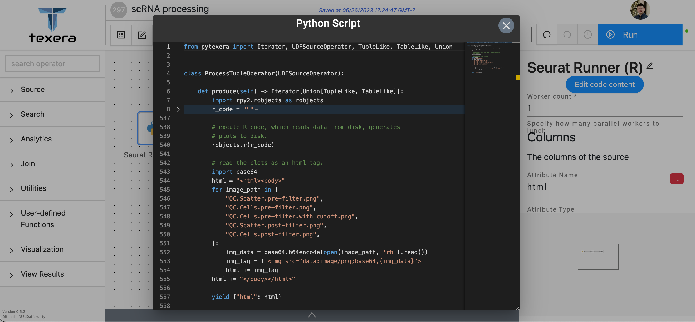
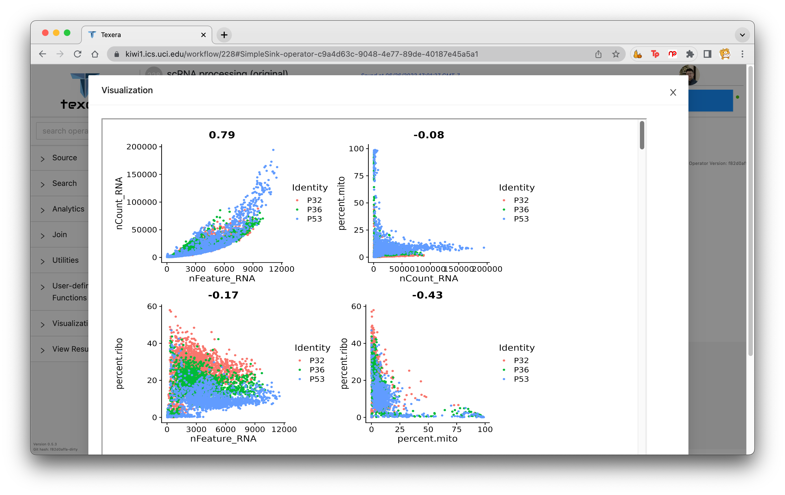
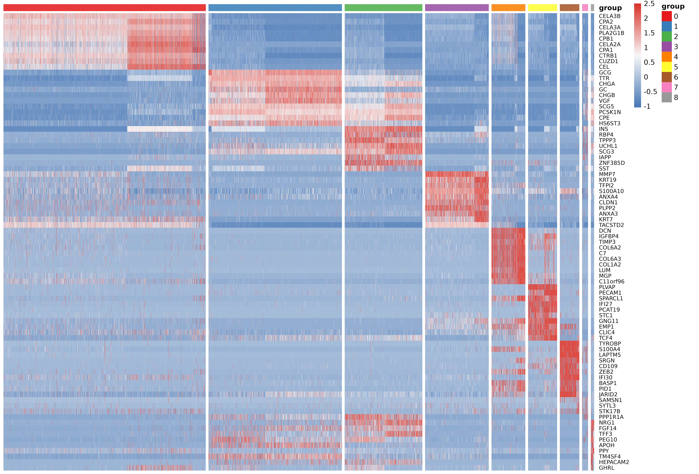
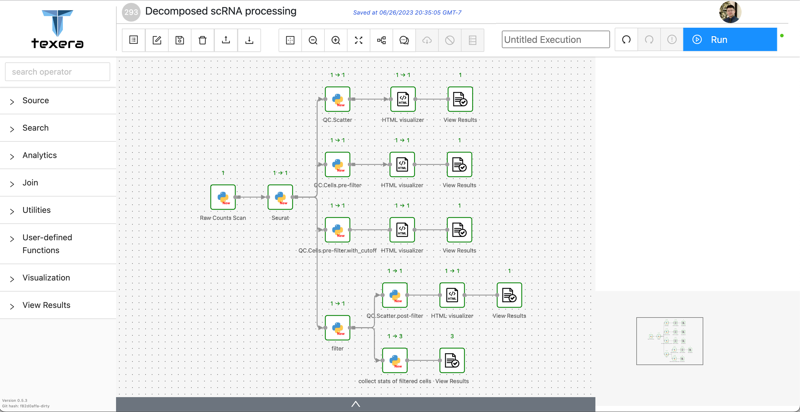

RNA sequence analysis has revolutionized our understanding of gene expression at the single-cell level, providing unprecedented insights into cellular heterogeneity and dynamics. [Seurat](https://satijalab.org/seurat/index.html), a popular R library, has emerged as a versatile toolkit for the comprehensive analysis of single-cell RNA sequencing ([scRNA-seq](https://www.ncbi.nlm.nih.gov/pmc/articles/PMC8964935/)) data.

While the core engine of Texera is built using Scala, it supports the integration of Python UDFs, allowing users to incorporate custom Python code directly into their data processing pipelines.
This capability enables users to leverage the versatility and extensive ecosystem of Python libraries for their data-processing tasks.
However, the Seurat library is primarily available in the R programming language, which poses a challenge when it comes to processing RNA sequence data with Texera, which previously did not support R.

In this post, we share our experience of overcoming the challenges of processing RNA sequence data with R in Texera by leveraging the platform's support for Python UDFs as a bridge.

### Task Overview
We have an existing script written in the R programming language that performs quality control (QC) on scRNA-seq data from human islets ([HPAP](https://www.ncbi.nlm.nih.gov/pmc/articles/PMC6609987/)) across different ages. The dataset includes samples from individuals aged 32, 36, and 53.
The R script loads the dataset, creates a Seurat instance to process the dataset, then generates plots to visualize the results.
The original R script contains 524 lines of code. We want to migrate the R script to run on Texera.

<details>
  <summary>The R script code (Partial)</summary>

```r
library(Seurat)
library(scater)
library(scran)
library(batchelor)
library(tidyverse)

# sample info
sample.info <- data.frame(SeqName=c('HPAP032','HPAP036','HPAP053'),
                         Group=c('T1D','No Diabetes','No Diabetes'),
                         Name=c('P32','P36','P53'))
rownames(sample.info) <- sample.info$Name

# load corrected UMI counts table per patient
raw.counts.list <- list()
for (k in 1:nrow(sample.info)){
   pid <- rownames(sample.info)[k]
   sid <- sample.info$SeqName[k]
   raw.counts.list[[k]] <- my.Read10X(file.path(sourcedir, sid, 'filtered_feature_bc_matrix'), pid)
}
names(raw.counts.list) <- rownames(sample.info)

...

# Initialize the Seurat object with the raw (non-normalized data).
panc.initial <- CreateSeuratObject(counts=raw.counts.all, project=project, assay="RNA", min.cells=0, min.features=0,
                                  names.field=1, names.delim="_", meta.data=NULL)

# Calculates the mitochondrial/ribosomal genes per cell
print(paste(length(grep(mito.pattern, rownames(panc.initial), value=T)), 'mitochondrial genes to consider.'))
print(paste(length(grep(ribo.pattern, rownames(panc.initial), value=T)), 'ribosomal genes to consider.'))

panc.initial[["percent.mito"]] <- PercentageFeatureSet(panc.initial, pattern=mito.pattern)
panc.initial[["percent.ribo"]] <- PercentageFeatureSet(panc.initial, pattern=ribo.pattern)

...

# scatter plot
plots <- list()
plots[[1]] <- FeatureScatter(panc.initial, feature1="nFeature_RNA", feature2="nCount_RNA")
plots[[2]] <- FeatureScatter(panc.initial, feature1="nCount_RNA", feature2="percent.mito")
plots[[3]] <- FeatureScatter(panc.initial, feature1="nFeature_RNA", feature2="percent.ribo")
plots[[4]] <- FeatureScatter(panc.initial, feature1="percent.mito", feature2="percent.ribo")
plots.combined <- (plots[[1]] | plots[[2]]) / (plots[[3]] | plots[[4]])
ggsave(file.path(figdir, "QC.Scatter.pre-filter.png"), width=9, height=7.5, dpi=300)

```

</details>

### Initial migration of R code in a single Python UDF
As a starting point, we took the R script as it is and migrated into Texera with one single UDF. The following Figure 1 shows the initial Texera workflow.

<figure>
<a href="single-udf-workflow.png">

</a>
<figcaption align = "center"><i>Figure 1. Initial workflow that executes R code in one single Python UDF.</i></figcaption>
</figure>

- The first operator, `Seuret Runner (R)`, is a Python UDF operator that executes the R source code, and renders the
  generated plots as a html.

- The second operator, `HTML Visualizer`, visualizes the generated html.

#### Python UDF code for Seurat Runner (R)
<figure>
  <a href="single-udf-code.png">
    
  </a>
  <figcaption align = "center">
    <i>
      Figure 2. The code of the single UDF which executes the entire R code as it is.
    </i>
  </figcaption>
</figure>

We used a single Python UDF operator to execute R script code. In line 8, the `r_code` variable takes the R script
source code, which we folded for simplicity, as a string. In line 540, we execute the `r_code` as its entirety with a
library called "[rpy2](https://rpy2.github.io)", which will invoke the Seurat library to perform the analysis and generate plots on disk.

After that, we read the generated plots from disk and put them into an html for visualization.

#### Executing R code in Python
In order to execute the R code within Python, we made use of the `rpy2` Python library.
This library facilitates the execution of R code within Python environments, enabling users to seamlessly call R functions, execute R scripts, and manipulate R objects directly from their Python code.

Specifically, in this single UDF implementation, we took R code as it is and executed it with:
```python
rpy2.robjects.r[r_code]
```

The evaluation of the R code took place within the Global Environment, which is the default starting point for R users when they access the R console.
In this environment, any variables created by the R code were automatically stored and becoming accessible for subsequent operations in R.
In this case, the Python UDF simply worked as an invoker of the R code, without any data transformation between the R environment and the Python environment.

#### Visualizing plots as an HTML
All the plots are rendered in one HTML file, which can be visualized in Texera. Users can click the "view result" operator to see the visualization pop up window. Figure 3 shows the Texera UI of rendering the visualized plots in HTML.

<figure>
  <a href="html-visualization.png">
    
  </a>
  <figcaption align = "center">
    <i>
      Figure 3. Visualized plots in Texera UI as an HTML.
    </i>
  </figcaption>
</figure>


Leveraging the extensive capabilities of HTML, Texera is able to effortlessly display the plots generated. Figure 4 presents several examples of the plots generated by the R code.

<figure>
  <div style="width:50%; float: left;padding: 20px;">
  <a href="umap-plot.png">
    
  </a>
  <figcaption align = "center" style="width:100%">
    <i>
      (A) UMAP plot by cell types.
    </i>
  </figcaption>
  </div>
  <div style="width:50%; float: left;padding: 20px;">
  <a href="scatterplot.png">
    
  </a>
  <figcaption align = "center" style="width:100%">
    <i>
      (B) Scatter plot by ages.
    </i>
  </figcaption>
  </div>
  <div style="padding: 20px;">
    <a href="heatmap-wilcox-plot.png">
      
    </a>
    <figcaption align = "center" style="width:100%">
      <i>
        (C) Heatmap wilcox plot.
      </i>
    </figcaption>
  </div>

  <figcaption align = "center" style="width:100%">
    <i>
      Figure 4. Some example plots generated by the R code for displaying scRNA sequences.
    </i>
  </figcaption>

</figure>

### Decomposing the single UDF into multiple UDFs
Next, we expanded the single UDF implementation into a more intricate workflow. Figure 5 illustrates the resulting workflow, which provides a more comprehensive and meaningful depiction of the data-processing steps.

<figure>
  <a href="decomposed-workflow.png">
    
  </a>
  <figcaption align = "center">
    <i>
      Figure 5. The complex workflow after decomposing the single UDF implementation.
    </i>
  </figcaption>
</figure>

- The `Raw Counts Scan` operator scans 3 scRNA datasets from disk and merges them into a two dimensional matrix.
- The `Seurat` operator creates the Seurat instance with the matrix by invoking the R library.
- The `QC` operators each generate one corresponding plot and embed it into an HTML string.
- The `HTML visualizer` operators visualize the generated plots respectively.
- The `filter` operator applies a filter logic on the Seurat instance.
- The `collect stats of filter cells` aggregates metadata of the filtered dataset.

#### Transferring R objects back to Python
In order to decompose the single UDF and utilize the edges to pass data between operators, we face the challenge of passing data from the R environment to the Python environment. `rpy2` library supports converters from R objects to Python objects.

For primitive data types such as integer and string, `rpy2` provides default converters. The R code executed with those converters can be available later in the hosting Python environment. In the following example, the R code assigns a variable `panc.initial`, with the converter enabled on the Python side:
``` python
with rpy2.robjects.conversion.localconverter(rpy2.robjects.default_converter) as cv:
    rpy2.robjects.r('panc.initial <- CreateSeuratObject(counts=raw.counts.all, project=project, assay="RNA", min.cells=0, min.features=0, names.field=1, names.delim="_", meta.data=NULL)')
```

After the R code executes, we can get the `panc.initial` instance as a Python object:
```python
panc_initial = rpy2.robjects.r['panc.initial']
```

For complex custom data structures and types, we can also provide our own converter implementation to accommodate rare use cases.

With converters, Python UDF in Texera can get the necessary data objects from the R environment back to Python.

#### Transferring R objects between operators
Another challenge to support the decomposed workflow is how to transfer the R data between two operators. In Texera, each operator is self-contained and has its individual processing environment. In this case, each Python UDF will have its own Python environment and R environment.

Consider the `Seurat` operator in Figure 5. It generates the Seurat instance and needs to share the same instance to five downstream operators, each performing different processing. To do so, we used Texera’s binary type to transfer the `Seurat` instance.
```python
class SeuratCreator(UDFTupleOperatorV2):

    def process_tuple(self, tuple_: Tuple, port: int)-> Optional[TupleLike]:

        ... # r code execution with converters enabled

        yield Tuple({"panc.initial": rpy2.robjects.r['panc.initial']}) # output as binary type
```

The binary type will be serialized by the Python’s serializer library, pickle, and sent to the downstream operators as bytes. The receiver operators will first deserialize with pickle, and make the instance available in the Python environment. Then, we need to make the instance available in the receiver operator’s R environment, thus we can assign it back to the corresponding R global environment:

```python
class ScatterplotGenerator(UDFTupleOperatorV2):

    def process_tuple(self, tuple_: Tuple, port: int)-> Optional[TupleLike]:

        # assign the Seurat instance into the current R environment
        rpy2.robjects.globalenv['panc.initial'] = tuple_['panc.initial']

        ... # use r code to generate plots from the Seurat instance

        yield Tuple({'html': rpy2.robjects.r['generated.plot.html']}

```

### Summary

In this blog, we shared the experience of migrating a scRNA sequence analysis task written in R into Texera, and overcame the fact that Texera does not have built-in R UDF support yet. Specifically, we discussed how to use the `rpy2` library to execute R code in the Python environment, how to transfer R objects into the Python environment and how to transfer R objects between two operators on the workflow. We also discussed the design of decomposing the R script into a fully fledged workflow, with visualization enabled with HTML operators.


#### Acknowledgements

Thanks to Prof. Shuibing Chen, Prof. Chen Li, and Dr. Tuo Zhang for their help with the task and the blog.

