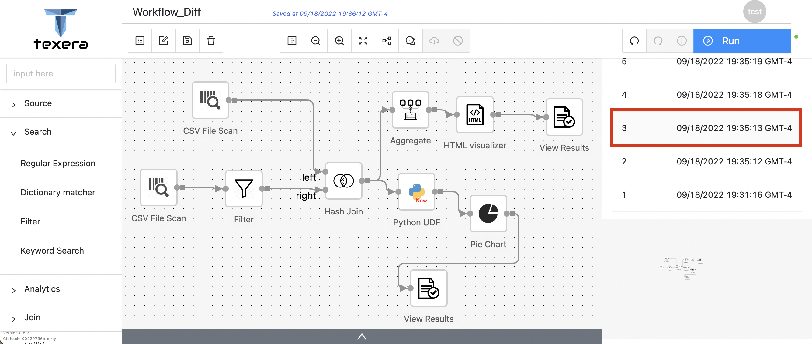

Texera has a version control system that automatically saves workflow drafts so users can easily view or restore early versions. However, the current implementation only shows the unannotated historical workflow. Users may find it hard to see how it differs from the existing workflow, especially when there is only a tiny change in one operator's property. Therefore, we want to improve the usability of the version control system by visually displaying the difference between the workflows.

### Task Overview
The task can be divided into two phases: calculating and showing the differences between the workflows.

In this task, we are showing all differences in an aggregated style (i.e., only displaying the historical version of workflow and highlighting the changes with respect to the current workflow). Although showing both versions side by side with highlights might better illustrate the changes, the current Texera system does not support displaying two workflows simultaneously, and an implementation of it would bring a significant change to the logistics of the system. Therefore, showing workflow differences in a “split” style is left for future enhancement.

To keep the user interface neat, we are only showing the differences of operators, while similar logic can be applied to other elements in the workflow, e.g., links and comment boxes, to show their difference between versions. For the simplicity of the user interface, operators' position changes have not been considered for now.

### Use Case
Here is the current workflow:

When the user selects Version #3 in the list on the right (highlighted in red), we retrieve that particular version from the version history and highlight the differences in workflow.

In this example, the Regular Expression operator got deleted in the current version, the Filter operator was recently added, and the Worker count property of Python UDF is changed from 1.

### Implementation
Once the user selects a particular version, we calculate the difference between the historical and the current workflow and highlight the differences.

#### Calculating the Differences
The `getWorkflowsDifference` function takes two workflow objects and returns all the IDs of operators that are different in the two versions.

For each operator, the change can be categorized into three types: 
- **Added**: the operator has been recently added by the user (only exists in current version)
- **Modified**: Only the operator properties have been modified (exists in both versions)
- **Deleted**: the operator is recently deleted by the user (only exists in the historical version)

To facilitate later comparison, we first create a map for each version, with operatorID as the key, and the operator properties as the value.

Then we ran two passes on the map.

In the first pass, we iterate through the operators of the historical version. Our goal is to find the added and modified operators. To find the added operators, we simply check if the operatorID exists in the keys of the map of the current version. If the operatorID exists in both versions, we then perform a deep comparison on the two operator properties associated with the operatorID using isEqual method from lodash, a JavaScript utility library. If they are different, we add the operatorID to the list of modified operators.

In the second pass, we iterate through the operators of the current version to generate a list of operators that have been deleted.

So far, we have obtained all IDs of operators that have been added, modified, or deleted between the two versions.

#### Highlighting the Differences
Because we only display the historical version on the user interface, all differences should be visible on one canvas.

For deleted and modified operators, we simply fill the `rect.boundary` attribute of the operator to give the operators a highlighted background. We arbitrarily use green to indicate deletion and orange to indicate the modification. Furthermore, we highlight the outline of modified properties in the property window on the right-hand side.

However, we cannot do the same for the added operators because they do not exist in the historical version we are displaying. Instead, we adopt a similar approach as Alteryx: putting brackets on the connected operators to indicate there are additional operators between them in the current version.

    

### Summary 
In this blog, we share how we visually display the differences between the workflows in the Texera version control system. This enhancement would improve the usability of the current version control system and help users to view and restore the right version they want.

#### Acknowledgement
Thanks to Professor Li and the Texera team, especially my mentor Sadeem, for helping me throughout this task.
