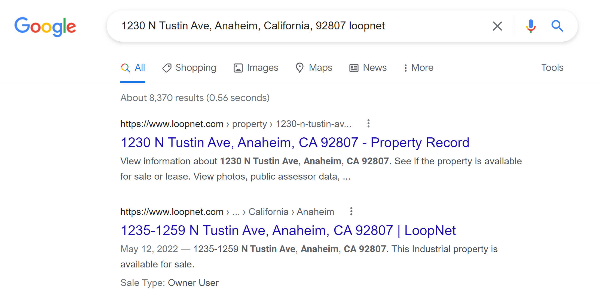
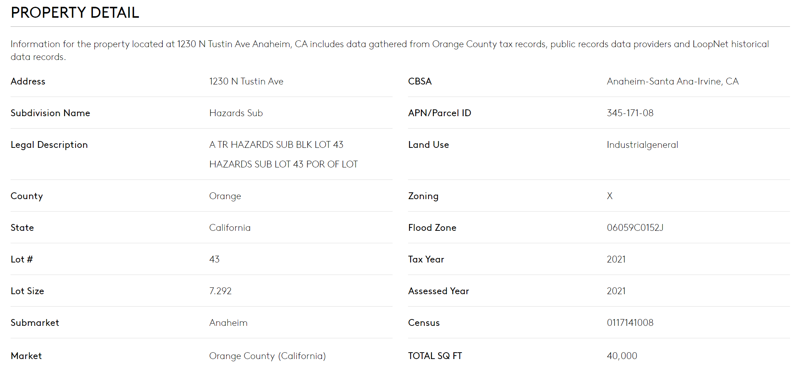
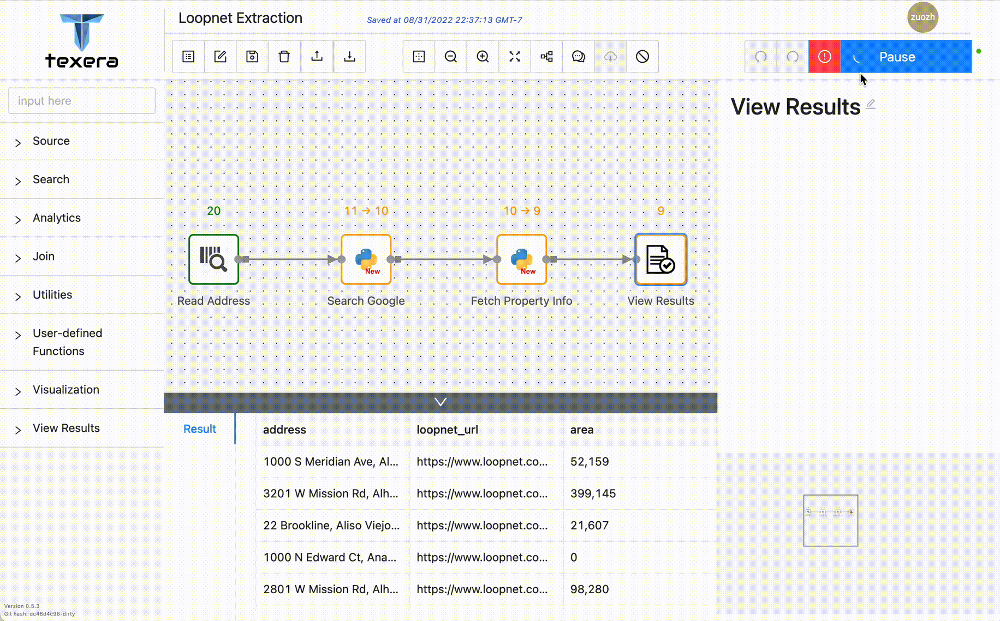
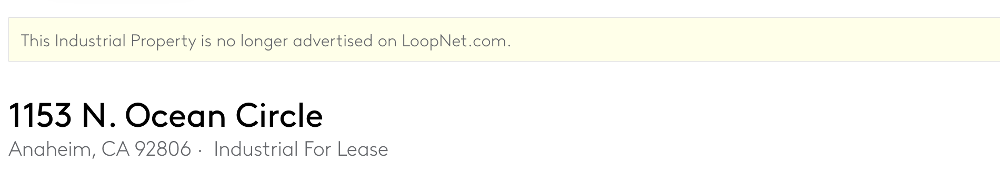

Crawling is a common yet important task to collect data from the Web. However, developing a good crawling pipeline is notoriously challenging due to the following reasons:
1. The content and format of the Web pages can be quite unpredictable. Many "edge cases" need to be covered by the crawler and the parser. Moreover, these edge cases can happen after the pipeline has been running for a long time. This could cause the parser to extract wrong information, or even crashing the program.

2. Many Web sites have rate-limiting or anti-crawling mechanisms. If not done carefully, the crawler might be blocked. One might run a crawler pipeline for a long time, then find out that the crawler is blocked. In such a case, the crawler needs to reduce the request rate on-the-fly, or even temporarily pause the execution. 

In this post, we share our experience on setting up a crawling pipeline on Texera, primarily using its Python User-Defined Function (UDF) support. Moreover, we show how Texera's dynamic execution control features, such as pausing, resuming, dynamically updating code on the fly, can help solve the above issues, and make it easier to develop and run such a pipeline.


### Task Overview
We have many warehouse addresses in California, as shown in the sample dataset below. We would like to find the size of the property on each address. We'll fetch the information from [loopnet.com](https://www.loopnet.com/), an online marketplace providing commercial property listings.

| address |
| :---- |
| 1230 N Tustin Ave, Anaheim, CA 92807 |
| 3201 W Mission Rd, Alhambra, California, 91803 |
| 1000 N Edward Ct, Anaheim, California, 92806 |
| 1045 S East St, Anaheim, California, 92805 |
| 2801 W Mission Rd, Alhambra, California, 91803 |
| ...... |
{.table-sm}

To fetch the information, we can follow the following procedures:
1. Search an address on Google followed by the keyword `loopnet`. Usually, the first Google search result points to the property record page that we are looking for.


2. Follow the URL to visit [loopnet.com](https://www.loopnet.com/). Navigating to the `PROPERTY DETAIL` section of the page, we find the size of the property in `TOTAL SQ FT`.



To repeat the same procedure for all the addresses, we programmatically implement a crawler and a parser using Texera's Python user-defined functions.
We also use the following Python libraries:
- [`requests`](https://requests.readthedocs.io/en/latest/) to make HTTP requests.
- [`BeautifulSoup`](https://beautiful-soup-4.readthedocs.io/en/latest/) to parse HTML pages and extract information.

### Texera Workflow Overview
The following screenshot shows the Texera workflow we have constructed.


- The first operator, `Read Address`, reads a CSV file containing the warehouse addresses we need to crawl.
- The second operator, `Search Google`, sends an HTTP request to Google and fetches the result HTML page. It then parses the HTML page to find the first search result and the URL of the loopnet page. The code for this operator can be found below.

<details>
  <summary>Python UDF code for operator "Search Google"</summary>

```python
class ProcessTupleOperator(UDFOperatorV2):
    
    @overrides
    def process_tuple(self, tuple_: Tuple, port: int) -> Iterator[Optional[TupleLike]]:
        address = tuple_['address']
        
        # fetch the google search result HTML page
        googleQuery = "http://google.com/search?q=" + urllib.parse.quote(address+ " loopnet")
        googlePage = requests.get(googleQuery)

        # parse the HTML page to extract URL from the top search result
        soup = BeautifulSoup(googlePage.text, 'html.parser')
        loopnetUrlRaw = [r for r in soup.find_all('a', href=True) if "loopnet.com" in r['href']][0]['href']
        loopnetUrl = loopnetUrlRaw[loopnetUrlRaw.find("http"): loopnetUrlRaw.rfind("/")]
        tuple_['loopnet_url'] = str(loopnetUrl)

        # avoid making crawling requests too frequently
        time.sleep(1)
        yield tuple_
```
</details>

- The third operator takes the loopnet URL and fetches the property listing page from loopnet.com. It parses the HTML page to locate the `PROPERTY DETAIL` section, and extracts the size information. 
<details>
  <summary>Python UDF code for operator "Fetch Property Info"</summary>

```python
class ProcessTupleOperator(UDFOperatorV2):
    
    @overrides
    def process_tuple(self, tuple_: Tuple, port: int) -> Iterator[Optional[TupleLike]]:
        self.loopnetUrl = tuple_['loopnet_url']

        # fetch loopnet HTML page
        self.loopnetPageHtml = requests.get(self.loopnetUrl, headers={"User-Agent": "Mozilla/5.0 (platform; rv:geckoversion) Gecko/geckotrail Firefox/firefoxversion"})
        loopnetPage = str(self.loopnetPageHtml.text)

        # parse the PROPERTY DETAIL section of the HTML page
        self.soup = BeautifulSoup(loopnetPage, 'html.parser')
        self.assessments = self.soup.find_all(class_="assessment-key")
        self.kv = {}
        for node in self.assessments:
            key = node.findChildren()[0].text.strip()
            value = node.parent.findChildren()[2].text.strip()
            self.kv[key] = value
        
        tuple_["area"] = self.kv["TOTAL SQ FT"]
    
        yield tuple_

```
</details>


Next, we run this workflow and check the results. Texera starts running the pipeline progressively and displays the results.


## Handling Edge Cases
As discussed in the beginning of this blog, the crawler and the parser often run into edge cases where the Web page's format or content changes. This is no exception for the warehouse address crawling task. After running the pipeline for a while, the job runs into an exception, as shown in the following animated gif. The error message shows `line 64, in process_tuple KeyError: 'TOTAL SQ FT'`. This indicates that the `TOTAL SQ FT` information is not extracted.




In Texera, an exception raised by the Python UDF will not crash the program. Instead, Texera gracefully catches the exception, reports the error to the user, and keeps the program in a paused state. We can interact with the Python UDF operator and inspect the tuple that causes this program to crash, and any internal state of the UDF operator.


We can easily find the address that causes this issue and visit its loopnet web page. This address is a corner case where the property is not listed on the Web site. 




We can see that both the page layout and the content are different from regular listings. Therefore, we need to update the parser code to extract the property size from `Building Size`, instead of `TOTAL SQ FT`. 

We can take advantage of Texera's functionality to change the parser on-the-fly, without restarting the crawling pipeline from scratch. The following gif shows the process, and the updated code can be seen below.


<details>
  <summary>Updated code for operator "Fetch Property Info" after fixing error</summary>

```python
class ProcessTupleOperator(UDFOperatorV2):
    
    @overrides
    def process_tuple(self, tuple_: Tuple, port: int) -> Iterator[Optional[TupleLike]]:
        self.loopnetUrl = tuple_['loopnet_url']

        # fetch loopnet HTML page
        self.loopnetPageHtml = requests.get(self.loopnetUrl, headers={"User-Agent": "Mozilla/5.0 (platform; rv:geckoversion) Gecko/geckotrail Firefox/firefoxversion"})
        loopnetPage = str(self.loopnetPageHtml.text)

        # check if the property is advertised on loopnet
        notAdvertised = "no longer advertised on LoopNet.com" in loopnetPage

        if notAdvertised:
            # parse the data of a property that is not advertised
            self.propertyData = self.soup.find(class_="property-data").find_all("td")
            propertyData = self.propertyData
            i = 0
            if propertyData is not None:
                while i < len(propertyData) - 2:
                    k = propertyData[i].text.strip()
                    v = propertyData[i+1].text.strip()
                    if k is not None and len(k) != 0:
                        self.kv[k] = v
                    i += 2

            tuple_["area"] = self.kv["Building Size"]
        else:
            # parse the PROPERTY DETAIL section of the HTML page
            self.soup = BeautifulSoup(loopnetPage, 'html.parser')
            self.assessments = self.soup.find_all(class_="assessment-key")
            self.kv = {}
            for node in self.assessments:
                key = node.findChildren()[0].text.strip()
                value = node.parent.findChildren()[2].text.strip()
                self.kv[key] = value
        
            tuple_["area"] = self.kv["TOTAL SQ FT"]
    
        yield tuple_

```
</details>


During the running of the crawling pipeline, there have been many instances of finding and fixing corner cases, such as:
- There are different phrases to indicate whether a property is advertised on loopnet. Some use "no longer advertised on LoopNet.com", and others use "no longer *being* advertised on LoopNet.com".
- Different property types use different keys to show property size.  Some use "TOTAL SQ FT", some use "Building Size", and others use "Total Rentable Area".

Using Texera, we are immediately notified when such edge cases happen, and we can fix the issues on the fly.


### Dynamically adjusting request rate

In the crawler implementation, we initially set a low rate of two requests per second for the crawler to avoid being blocked. After running the pipeline for a while, we notice that the crawler does not reach the limit of the crawled Web sites.  Thus we increase the request rate to five requests per second to make the pipeline run faster. 


Similarly, when the crawler starts to get an invalid response from the Web site, it is a sign of the request rate being too high. In this case, we can again reduce the request rate. 


### Summary
In this blog, we share the experience of using Texera to build a crawling pipeline to collect Web data. Texera's powerful ability to control the pipeline execution allows us to monitor issues during runtime and fix the issues on the fly. 
